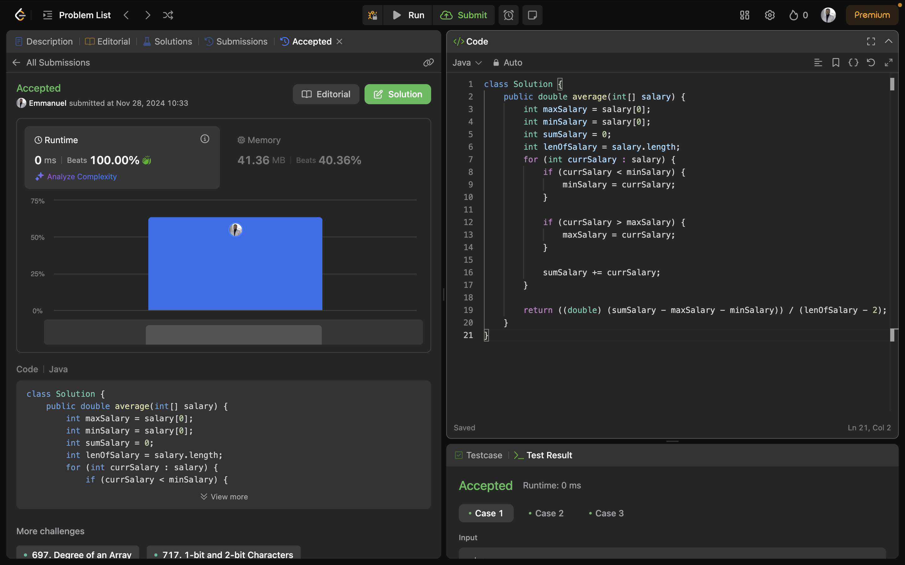

# Week 10 Leetcode Challenges
**Cohort 6**
**Section 3**
**Team 11**
Members: **(Emmanuel) Oluwatope Alofe** [@oluwxtope](https://github.com/oluwxtope), **(Sophie) Anne-Sophie Simon** [@annesophiesimon](https://github.com/annesophiesimon), **Nimi Bara-Hart** [@nimibara-hart](https://github.com/NimiBara-hart)

## Challenge 1: Average Salary Excluding the Minimum and Maximum Salary
Link: [Average Salary Excluding the Minimum and Maximum Salary](https://leetcode.com/problems/average-salary-excluding-the-minimum-and-maximum-salary/description/)

**Solution**
- Initialize variables to keep track of the minimum salary, maximum
  salary, sum of the salaries and the length of the salary array
- Loop through the salary array
    - Add the current salary to the sum of salaries variable
    - If the current salary is less than the minimum salary, update the minimum salary variable
    - If the current salary is greater than the maximum salary, update the maximum salary variable
- At the end, remove the maximum and minimum salary from the sum of salaries and divide it by the length of salaries - 2 (we removed 2 salaries, min and max) to get the average salary excluding the mimum and maximum salaries

## Challenge 2: Squares of a Sorted Array
Link: [Squares of a sorted Array](https://leetcode.com/problems/squares-of-a-sorted-array/description/)

**Solution**
- Create a stream from the array to enable the use of operations like map(), sorted().
- Call map() to square each element of the array
- Call sorted() to sort the squared value in ascending order
- Call to Array() to convert the stream back to an array 

