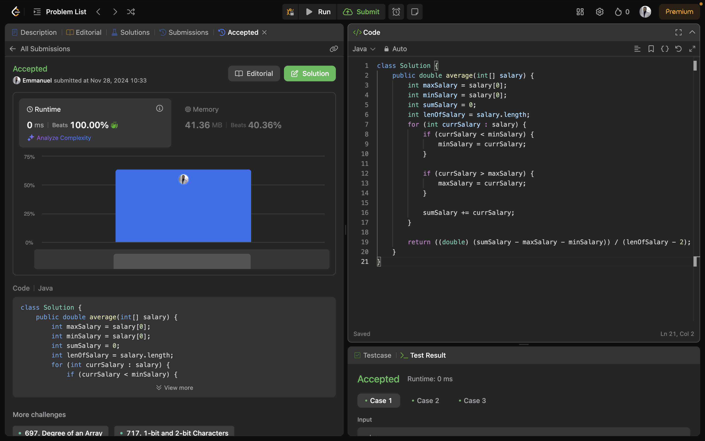
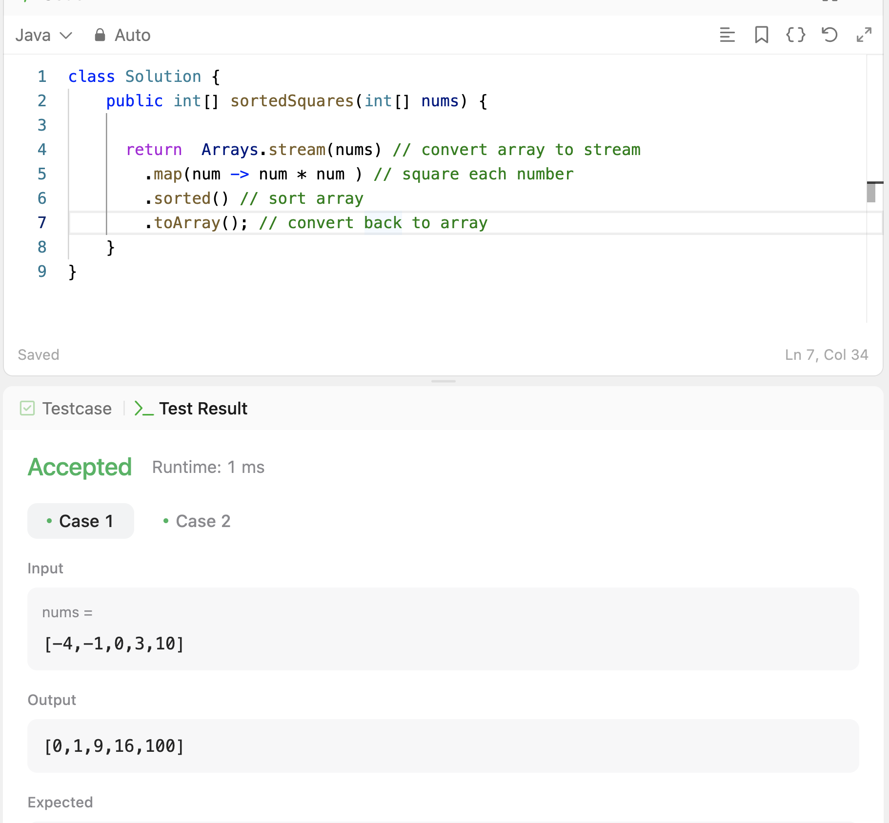
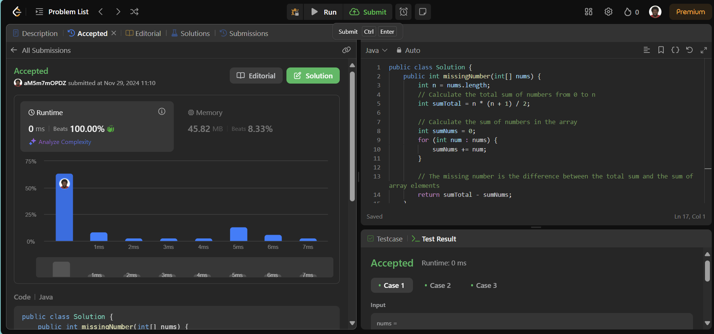
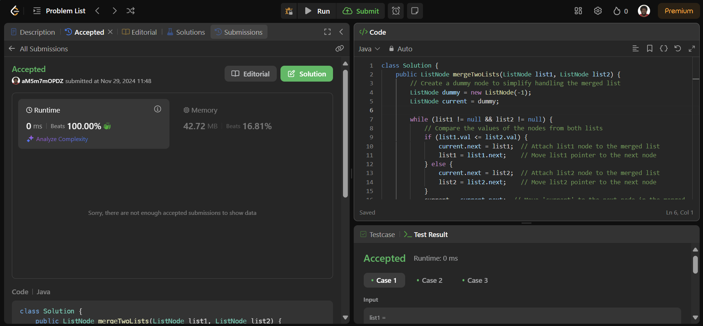

# Week 10 Leetcode Challenges

**Cohort 6**  
**Section 3**  
**Team 11**  
Members: **(Emmanuel) Oluwatope Alofe** [@oluwxtope](https://github.com/oluwxtope), **(Sophie) Anne-Sophie Simon
** [@annesophiesimon](https://github.com/annesophiesimon), **Nimi Bara-Hart
** [@nimibara-hart](https://github.com/NimiBara-hart)

## Challenge 1: Average Salary Excluding the Minimum and Maximum Salary

Link: [Average Salary Excluding the Minimum and Maximum Salary](https://leetcode.com/problems/average-salary-excluding-the-minimum-and-maximum-salary/description/)

**Solution**

- Initialize variables to keep track of the minimum salary, maximum
  salary, sum of the salaries and the length of the salary array
- Loop through the salary array
    - Add the current salary to the sum of salaries variable
    - If the current salary is less than the minimum salary, update the minimum salary variable
    - If the current salary is greater than the maximum salary, update the maximum salary variable
- At the end, remove the maximum and minimum salary from the sum of salaries and divide it by the length of salaries -
  2 (we removed 2 salaries, min and max) to get the average salary excluding the minimum and maximum salaries

## Challenge 2: Squares of a Sorted Array

Link: [Squares of a sorted Array](https://leetcode.com/problems/squares-of-a-sorted-array/description/)

**Solution**

- Create a stream from the array to enable the use of operations like map(), sorted().
- Call map() to square each element of the array
- Call sorted() to sort the squared value in ascending order
- Call to Array() to convert the stream back to an array 

## Challenge 3: Missing Number

Link: [Missing Number](https://leetcode.com/problems/missing-number/)

**Solution**

- Calculate the total sum of numbers from 0 to n
- Calculate the sum of numbers in the array
- The missing number is the difference between the total sum and the sum of array elements

## Challenge 4: Add Two Numbers

Link: [Add Two Numbers](https://leetcode.com/problems/add-two-numbers/)

**Solution**

- Create a new ListNode object to track the result list called res. Track head of result ListNode object with variable
  headRes
- Loop indefinitely until a break statement is reached:
    - Retrieve the value of l1 and l2 if each is not null, otherwise set each to 0
    - Compute the sum of l1 value, l2Value, and the current value of res
    - Set boolean variable to track if sum is greater than 10 and there is overflow
    - If there is overflow, store only the last digit in res.val, else store the entire sum
    - Set res.next to a new ListNode with a value of 1 if there's overflow, otherwise, initialize it with 0
    - If l1 or l2 not null, move to their next values
    - If both l1 and l2 are null:
        - Check if res.next.val is 0. If it is, set res.next to null to remove the leading zero
        - Break the loop
    - Otherwise, set res to next node

## Challenge 5: Merge Two Sorted Lists

Link: [Merge Two Sorted Lists](https://leetcode.com/problems/merge-two-sorted-lists/)

**Solution**

- Create a dummy node to simplify handling the merged list
- Compare the values of the nodes from both lists
- If one of the lists is not yet empty, append it to the merged list
- Return the merged list, which starts after the dummy node

